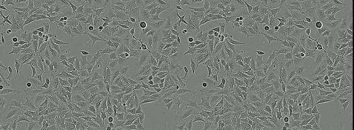

# Video-Stabilizer

This is a minimal package implementing video stabilization specifically tuned for microscopic time-lapses.



## Get started

Install using pip
```
pip install video_stabilizer
```

## Examples

We can stabilize a sequence of frames given as a sequence of paths.

```python
import video_stabilizer

paths = [...] 
frame_generator = video_stabilizer.FrameGenerator(paths)

for stabilized_frame, transform in video_stabilizer.stabilize_video(frame_generator):
    do_something(stabilized_frame, transform)
```

Or frames given by a `cv2.VideoCapture`:

```python
import cv2
import video_stabilizer

cap = cv2.VideoCapture(...)
frame_generator = video_stabilizer.generate_frames_from_video(cap)  # Ph stands for phase-images

for stabilized_frame, transform in video_stabilizer.stabilize_video(frame_generator):
    do_something(stabilized_frame, transform)
```

## License

Distributed under the MIT-license. See `LICENSE` for more information.

&copy;	 2020 Sartorius AG